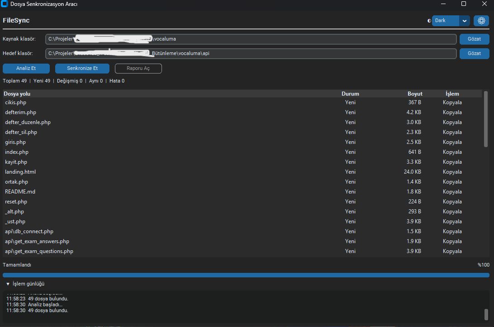
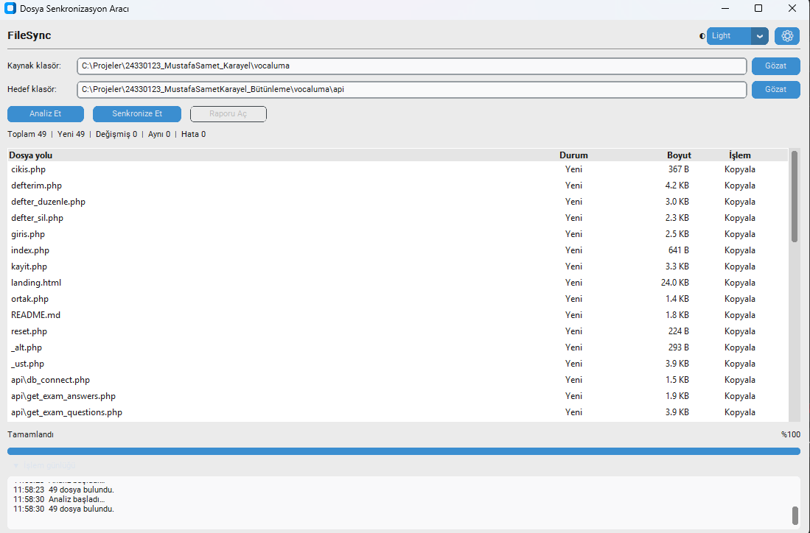

# FileSync

Python ve CustomTkinter ile geliştirilmiş masaüstü klasör senkronizasyon aracı.

## Genel Bakış

FileSync, bir kaynak klasör ile bir hedef klasörü karşılaştırır ve aradaki farkları belirler. Kaynakta bulunup hedefte olmayan **yeni** dosyaları ve içeriği farklılaşmış **değişmiş** dosyaları tespit eder.

Senkronizasyon, kullanıcı önizlemeyi görüp onay verdikten sonra başlar ve yalnızca gerçekten kopyalanması gereken dosyaları hedefe aktarır. Aynı olan dosyalar atlanır.

Hedef klasörde bulunup kaynakta olmayan fazladan dosyalar **silinmez**. Araç tek yönlü çalışır: kaynaktan hedefe.

## Özellikler

- Alt klasörler dahil özyinelemeli tarama
- Dosya boyutu, son değiştirilme zamanı ve gerektiğinde SHA-256 ile karşılaştırma
- Senkronizasyon öncesi önizleme (dosya listesi ve durum özeti)
- İlerleme göstergesi ve yüzde bilgisi
- Açılıp kapanabilen işlem günlüğü
- TXT ve JSON biçiminde senkronizasyon raporu
- Açık, koyu ve sistem teması
- Son kullanılan kaynak ve hedef klasörleri saklama
- Kaynak/hedef klasör doğrulaması (aynı klasör ve iç içe klasör kontrolü)
- Thread ve queue kullanımıyla işlem sırasında donmayan arayüz
- `RotatingFileHandler` ile ayrı bir teknik log dosyası
- Bir dosyada hata oluşsa bile kalan dosyalarla devam etme

## Ekran Görüntüleri

### Koyu tema



### Açık tema



## Teknolojiler

- Python
- CustomTkinter
- ttk.Treeview
- pathlib
- hashlib
- shutil
- threading
- queue
- logging
- pytest

## Proje Yapısı

```text
file-sync-app/
├── main.py
├── requirements.txt
├── .gitignore
├── app/
│   ├── __init__.py
│   ├── constants.py
│   ├── models.py
│   ├── validators.py
│   ├── sync_engine.py
│   ├── report_manager.py
│   ├── settings_manager.py
│   └── ui.py
├── tests/
│   ├── __init__.py
│   ├── test_sync_engine.py
│   ├── test_report_manager.py
│   ├── test_settings_manager.py
│   ├── test_edge_cases.py
│   └── test_ui_helpers.py
├── logs/
└── reports/
```

## Kurulum

Windows üzerinde:

```bash
git clone https://github.com/Mskarayel/file-sync-app.git
cd file-sync-app
py -m pip install -r requirements.txt
```

## Çalıştırma

```bash
py main.py
```

## Kullanım

1. **Kaynak klasör** alanında *Gözat* ile kaynak klasörü seçin.
2. **Hedef klasör** alanında *Gözat* ile hedef klasörü seçin.
3. *Analiz Et* ile karşılaştırmayı başlatın.
4. Tabloda yeni, değişmiş ve aynı dosyaları inceleyin.
5. *Senkronize Et* ile kopyalamayı başlatın.
6. Açılan özet penceresinde işlemi onaylayın.
7. İşlem bitince *Raporu Aç* ile oluşturulan raporu görüntüleyin.

## Testler

```bash
py -m pytest -v
```

Projede 31 test bulunur.

## Karşılaştırma Mantığı

Her dosya kaynak ve hedefte şu sırayla karşılaştırılır:

1. Boyut farklıysa dosya **değişmiş** kabul edilir.
2. Boyut aynıysa son değiştirilme zamanı (`mtime`) kontrol edilir.
3. Boyut aynı, zaman farklıysa **SHA-256** özetleri karşılaştırılır.
4. Kopyalama `shutil.copy2` ile yapılır; dosyanın zaman bilgisi korunur.

## Güvenlik Davranışları

- Kaynak ve hedef klasörün aynı olması engellenir.
- İç içe klasörler (biri diğerinin altında) engellenir.
- Senkronizasyon başlamadan önce kullanıcı onayı gerekir.
- Hedefteki fazladan dosyalar silinmez.
- Tek bir dosyadaki hata tüm işlemi durdurmaz; hatalı dosya rapora eklenir.

## Raporlar ve Loglar

- Senkronizasyon raporları `reports/` klasörüne yazılır.
- Raporlar TXT ve JSON biçiminde, zaman damgalı dosya adlarıyla üretilir.
- Teknik uygulama günlüğü `logs/app.log` dosyasında tutulur ve kullanıcıya gösterilen işlem günlüğünden ayrıdır.

## Bilinen Sınırlamalar

- Çift yönlü senkronizasyon yoktur; kopyalama yalnızca kaynaktan hedefe yapılır.
- Hedefteki fazladan dosyaları silme özelliği yoktur.
- Çok büyük dosya listelerinde sanal tablo (virtual scrolling) kullanılmaz; tüm satırlar tek seferde yüklenir.
- Windows odaklı masaüstü kullanım için geliştirilmiştir.

## Lisans

Bu proje eğitim ve staj değerlendirmesi amacıyla geliştirilmiştir.

## Geliştirici

Mustafa Samet Karayel
